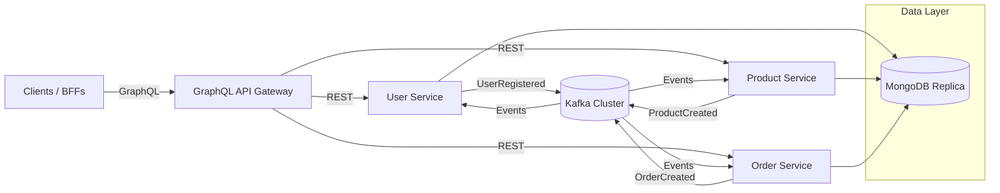

# Ecom Microservice GraphQL

## Executive Summary
Ecom Microservice GraphQL is a production-ready e-commerce reference stack composed of independently deployable Node.js microservices for users, products, and orders. A federating GraphQL gateway exposes a unified API while Kafka propagates domain events to keep services loosely coupled. The system is containerized with Docker, persists data in MongoDB, and is engineered for horizontal scalability and event-driven consistency.

## Architecture


## Features
- GraphQL gateway federating RESTful user, product, and order microservices.
- Event-driven choreography via Kafka topics for cross-domain updates.
- MongoDB persistence with per-service databases and decoupled schemas.
- Docker Compose orchestration including MongoDB, Zookeeper, Kafka, and services.
- Consumer/producer pairs enabling eventual consistency and auditability.
- Automated tests per service with Jest for API and resolver coverage.

## Tech Stack
- `Node.js 16+`, `Express`, `Apollo Server`, `axios`.
- `MongoDB` with Mongoose ODM.
- `Kafka` (Confluent images) plus `kafka-node` client.
- `Docker` and `docker-compose` for local orchestration.
- `Jest` for unit and integration testing.
- `dotenv` for per-service configuration management.

## Service Breakdown
### GraphQL Gateway (`graphql-gateway`)
- Apollo Server v2 instance exposing queries and mutations for users, products, and orders.
- Resolves operations by delegating to service-specific REST endpoints defined via `USER_SERVICE_URL`, `PRODUCT_SERVICE_URL`, and `ORDER_SERVICE_URL`.
- Aggregates responses into GraphQL schema types and returns unified payloads to clients.

### User Service (`user-service`)
- Express API managing user lifecycle (create, list, fetch by id) backed by MongoDB.
- Produces `UserRegistered` events to Kafka topic `user-events` and consumes the same stream for downstream coordination.
- Validates payloads via middleware and exposes JWT-ready hooks (`JWT_SECRET` placeholder) for future auth.

### Product Service (`product-service`)
- Express API handling product catalog operations with MongoDB persistence.
- Emits `ProductCreated` events to topic `product-events` and listens for product-domain events for eventual consistency tasks.

### Order Service (`order-service`)
- Express API for order creation, listing, and retrieval with MongoDB storage.
- Publishes JSON payloads on the `order_created` topic (see Kafka topics section for alignment guidance) and subscribes to the same stream for post-processing.

## Data Flow
- **GraphQL resolution**: Clients send GraphQL queries/mutations to the gateway → resolvers call downstream REST endpoints via Axios → microservices execute domain logic and respond → gateway maps JSON responses to GraphQL schema and returns them to the client.
- **Event propagation**: Microservices persist state in MongoDB, then emit Kafka events (`UserRegistered`, `ProductCreated`, `OrderCreated`) via their producers → Kafka brokers replicate events across partitions → subscribed consumers in each service react (logging, cross-service updates, notifications). Ensure the `order_created` topic aligns with provisioned Kafka topics in `kafka/topics/topicConfig.json`.

## Setup Instructions
### 1. Prerequisites
- Node.js 16+ and npm.
- Docker Desktop with Compose v2.
- Kafka CLI (optional, for debugging topics).

### 2. Environment Variables
Create per-service `.env` files or export the following variables. Example values assume Docker Compose defaults.

| Service | Variable | Description | Example |
| --- | --- | --- | --- |
| All services | `JWT_SECRET` | Symmetric signing key placeholder (optional for current build) | `supersecret` |
| User/Product/Order | `MONGO_URI` | MongoDB connection string | `mongodb://localhost:27017/user-service` |
| User/Product/Order | `PORT` | Service HTTP port | `3001` / `3002` / `3003` |
| User/Product/Order | `KAFKA_BROKER` | Kafka bootstrap server | `localhost:9092` |
| GraphQL gateway | `PORT` | Gateway port | `4000` |
| GraphQL gateway | `USER_SERVICE_URL` | Base URL for REST delegation | `http://localhost:3001` |
| GraphQL gateway | `PRODUCT_SERVICE_URL` | Base URL for REST delegation | `http://localhost:3002` |
| GraphQL gateway | `ORDER_SERVICE_URL` | Base URL for REST delegation | `http://localhost:3003` |

### 3. Local Development (without Docker)
1. Install dependencies per package:
	 ```powershell
	 npm install
	 npm install --prefix user-service
	 npm install --prefix product-service
	 npm install --prefix order-service
	 npm install --prefix graphql-gateway
	 npm install --prefix kafka
	 ```
2. Start MongoDB and Kafka locally or via Docker containers.
3. Export environment variables / create `.env` files as listed above.
4. Run services in separate terminals:
	 ```powershell
	 npm start --prefix user-service
	 npm start --prefix product-service
	 npm start --prefix order-service
	 npm start --prefix graphql-gateway
	 ```
5. Execute tests as needed:
	 ```powershell
	 npm test --prefix user-service
	 npm test --prefix product-service
	 npm test --prefix order-service
	 npm test --prefix graphql-gateway
	 ```

### 4. Dockerized Runtime
1. Create a `.env` file in the project root containing `JWT_SECRET=<your-secret>`.
2. Build and start the full stack:
	 ```powershell
	 docker compose up --build
	 ```
3. Access services:
	 - GraphQL Playground: `http://localhost:4000/`
	 - REST endpoints: `http://localhost:3001/users`, `http://localhost:3002/products`, `http://localhost:3003/orders`
4. Stop the stack:
	 ```powershell
	 docker compose down
	 ```

## Folder Structure
```text
ecom-microservice-graphql/
├── docker-compose.yml
├── graphql-gateway/
│   ├── src/
│   │   ├── resolvers/
│   │   ├── schemas/
│   │   └── server.js
│   └── tests/
├── kafka/
│   ├── consumers/
│   ├── topics/
│   └── package.json
├── order-service/
│   ├── src/
│   │   ├── controllers/
│   │   ├── events/
│   │   ├── models/
│   │   ├── routes/
│   │   └── services/
│   └── tests/
├── product-service/
│   ├── src/
│   │   ├── controllers/
│   │   ├── events/
│   │   ├── models/
│   │   ├── routes/
│   │   └── services/
│   └── tests/
└── user-service/
		├── src/
		│   ├── controllers/
		│   ├── events/
		│   ├── middleware/
		│   ├── models/
		│   ├── routes/
		│   └── services/
		└── tests/
```

## GraphQL API Usage
### Query
```graphql
query FetchDashboardData {
	getUsers {
		id
		name
		email
	}
	getProducts {
		id
		name
		price
	}
	getOrders {
		id
		status
		quantity
	}
}
```

### Mutation
```graphql
mutation PlaceOrder {
	createOrder(productId: "PRODUCT_ID", userId: "USER_ID", quantity: 2) {
		id
		status
	}
}
```

## Kafka Topics & Events
| Topic | Producers | Consumers | Payload Schema |
| --- | --- | --- | --- |
| `user-events` | `user-service` (`UserRegistered`) | `user-service` (self-processing) and any downstream subscribers | `{ type: "UserRegistered", data: User }` |
| `product-events` | `product-service` (`ProductCreated`) | `product-service` (self-processing) and downstream subscribers | `{ type: "ProductCreated", data: Product }` |
| `order_created`* | `order-service` (order creation events) | `order-service` (self-processing) + downstream | `Order` JSON payload |

*Provisioning script `kafka/topics/topicConfig.json` defines `order-events`; ensure topic names align before production deployment (adjust producer/consumer or broker topics accordingly).

## Scalability Notes
- Stateless services enable horizontal scaling behind load balancers or service meshes.
- Kafka partitions (default 3) can be increased per topic to parallelize event consumption; adjust consumer group instances accordingly.
- MongoDB can be upgraded to a replica set or sharded cluster to support high write volumes.
- Apollo Gateway supports schema stitching and distributed tracing; integrate with DataLoader to reduce REST fan-out.
- Container images are build-ready for CI/CD pipelines; push to registries and orchestrate via Kubernetes or ECS for managed scaling.

## Troubleshooting
- **Kafka timeouts**: Verify `KAFKA_BROKER` values (`localhost:9092` locally, `kafka:29092` in Docker). Ensure topics exist (`kafka-topics --bootstrap-server localhost:9092 --list`).
- **MongoDB connection failures**: Confirm `MONGO_URI` points to a reachable instance; when running via Docker Compose, use service names (`mongodb`).
- **GraphQL resolver errors**: Missing downstream URLs produce `ECONNREFUSED`; check `USER_SERVICE_URL`, `PRODUCT_SERVICE_URL`, `ORDER_SERVICE_URL` environment variables.
- **Topic name mismatch**: Align `order_created` producer/consumer topic with broker provisioning (`order-events`) to avoid dropped order events.
- **Container restarts**: Inspect logs (`docker compose logs <service>`) for stack traces; confirm `.env` is mounted and secrets resolved.

## License
Released under the MIT License. See `LICENSE` (add the file if absent) for full text.

